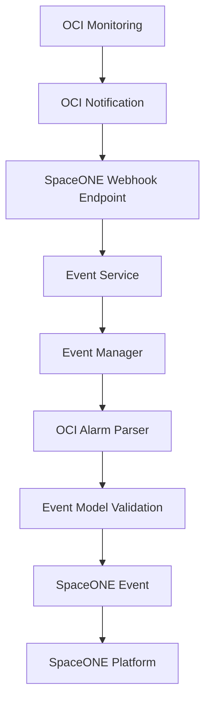

**Language**: [English](README.md) | [한국어](README_KR.md)

<h1 align="center">OCI Monitoring Webhook Plugin</h1>   

<br/>  
  
<br/>
<div>
    <p> 
        <br>  
        <a href="https://www.apache.org/licenses/LICENSE-2.0"  target="_blank"></a> 
    </p> 
</div>
<br/>

**SpaceONE Monitoring Webhook Plugin for Oracle Cloud Infrastructure**

The plugin-oci-monitoring-mon-webhook enables SpaceONE to receive and process monitoring alerts from Oracle Cloud Infrastructure (OCI) Monitoring service through webhook endpoints, providing seamless integration with OCI's monitoring and alerting capabilities.

---

## Table of Contents

- [Overview](#overview)
- [Features](#features)
- [Webhook Data Schema](#webhook-data-schema)
- [Event Processing Logic](#event-processing-logic)
- [Usage Examples](#usage-examples)
- [Testing](#testing)
- [Plugin Architecture](#plugin-architecture)
- [Development](#development)
- [Error Handling](#error-handling)

---

## Overview

This plugin transforms OCI alarm notifications into SpaceONE events through webhook endpoints. It supports various OCI services including Compute, Database, Storage, Networking, and more, providing unified monitoring across your Oracle Cloud Infrastructure.

### Key Benefits
- **Unified Monitoring**: Centralize OCI alerts within SpaceONE platform
- **Real-time Processing**: Immediate event processing from OCI webhooks
- **Standardized Format**: Convert OCI-specific data to SpaceONE standard events
- **Multi-service Support**: Handle alerts from various OCI services

---

## Features

### Core Capabilities
- **OCI Webhook Processing**: Receive and parse OCI Monitoring webhook notifications
- **Event Transformation**: Convert OCI alarm data to SpaceONE event format
- **Multi-alarm Support**: Process multiple alarms in a single webhook payload
- **Automatic Deduplication**: Use OCI dedupeKey for event deduplication
- **Resource Mapping**: Extract resource information from OCI alarm metadata
- **Severity Mapping**: Map OCI severity levels to SpaceONE standards
- **State Transition**: Handle alarm state changes (RECOVERY, ALERT)

### Supported OCI Services
- **Compute**: Instances, Custom Images, Autoscaling
- **Database**: Autonomous Database, MySQL, PostgreSQL, NoSQL
- **Storage**: Block Volume, Object Storage, File Storage
- **Networking**: VCN, Load Balancers, FastConnect
- **Security**: Key Management, WAF
- **Monitoring**: Alarms, Metrics
- **And more**: All OCI services that support monitoring alarms

---

## Webhook Data Schema

### OCI Webhook Payload Structure

The plugin expects OCI Monitoring webhook notifications with the following structure:

#### **Required Fields:**
- `dedupeKey`: Unique identifier for alarm deduplication
- `alarmMetaData`: Array containing alarm details and metadata

#### **Optional Fields:**
- `title`: Alarm title/name
- `body`: Alarm description
- `type`: Alarm state transition type (OK_TO_FIRING, FIRING_TO_OK, etc.)
- `severity`: Alarm severity level (CRITICAL, ERROR, WARNING, INFO)
- `timestamp`: Alarm occurrence timestamp
- `timestampEpochMillis`: Epoch timestamp in milliseconds

#### **Sample Webhook Payload:**

```json
{
  "dedupeKey": "6b28ce05-7021-4407-b9c0-xxxxxxx",
  "title": "Database Availability Alert",
  "body": "Database availability outside threshold",
  "type": "OK_TO_FIRING",
  "severity": "CRITICAL",
  "timestampEpochMillis": 1761563100000,
  "timestamp": "2025-10-27T11:05:00Z",
  "alarmMetaData": [
    {
      "id": "ocid1.alarm.oc1.ap-seoul-1.aaaaaaaazxxxxxx",
      "status": "FIRING",
      "severity": "CRITICAL",
      "namespace": "oci_autonomous_database",
      "query": "DatabaseAvailability[5m]{deploymentType = \"Shared\"}.rate() not in (1, 10)",
      "dimensions": [
        {
          "resourceId": "OCID1.AUTONOMOUSDATABASE.OC1.AP-SEOUL-1.ANUWGLJRExxxxxx",
          "resourceName": "ARAMCODEVAUTONOMOUS",
          "region": "ap-seoul-1"
        }
      ],
      "alarmUrl": "https://cloud.oracle.com/monitoring/alarms/ocid1.alarm.oc1.ap-seoul-1.aaaaaaaazxxxxxx?region=ap-seoul-1",
      "alarmSummary": "Database availability monitoring alarm"
    }
  ]
}
```

---

## Event Processing Logic

### Event Key Generation
Uses `raw_data.dedupeKey` as the unique event identifier for deduplication.

### Event Type Mapping
| OCI Type | SpaceONE Event Type |
|----------|-------------------|
| OK_TO_FIRING, REPEAT | ALERT |
| FIRING_TO_OK, RESET | RECOVERY |

### Severity Mapping
| OCI Severity | SpaceONE Severity |
|-------------|------------------|
| CRITICAL | CRITICAL |
| ERROR | ERROR |
| WARNING | WARNING |
| INFO | INFO |

### Resource Information Extraction
Extracts resource details from alarm dimensions:
- `resource_id`: OCI resource OCID
- `name`: Resource display name
- `resource_type`: Set to "inventory.CloudService"

### Additional Information
Includes supplementary alarm data:
- `alarm_url`: Direct link to OCI alarm
- `namespace`: OCI service namespace
- `status`: Current alarm status
- `region`: OCI region

---

## Usage Examples

### SpaceONE Event Output

When an OCI alarm is processed, the plugin generates a SpaceONE event:

```json
{
  "event_key": "6b28ce05-7021-4407-b9c0-xxxxxxx",
  "event_type": "ALERT",
  "title": "Database Availability Alert (CRITICAL)",
  "description": "Database availability outside threshold",
  "severity": "CRITICAL",
  "resource": {
    "resource_id": "OCID1.AUTONOMOUSDATABASE.OC1.AP-SEOUL-1.ANUWGLJRExxxxxx",
    "name": "ARAMCODEVAUTONOMOUS",
    "resource_type": "inventory.CloudService"
  },
  "rule": "DatabaseAvailability[5m]{deploymentType = \"Shared\"}.rate() not in (1, 10)",
  "occurred_at": "2025-10-27T11:05:00Z",
  "additional_info": {
    "alarm_url": "https://cloud.oracle.com/monitoring/alarms/ocid1.alarm.oc1.ap-seoul-1.aaaaaaaazxxxxxx?region=ap-seoul-1",
    "namespace": "oci_autonomous_database",
    "status": "FIRING",
    "region": "ap-seoul-1"
  }
}
```

---

## Testing

### Manual Testing with cURL

Test the webhook endpoint with a sample OCI notification:

```bash
curl -X POST https://your-spaceone-webhook-url/monitoring/v1/webhook/{webhook_id}/{access_key}/events \
  -H "Content-Type: application/json" \
  -d '{
    "dedupeKey": "test-dedupe-key-123",
    "title": "Test Database Alert",
    "body": "Test notification from OCI Monitoring",
    "type": "OK_TO_FIRING",
    "severity": "WARNING",
    "timestamp": "2025-11-23T10:00:00Z",
    "alarmMetaData": [
      {
        "id": "ocid1.alarm.oc1.test.example",
        "status": "FIRING",
        "severity": "WARNING",
        "namespace": "oci_compute",
        "query": "CPUUtilization[1m].mean() > 80",
        "dimensions": [
          {
            "resourceId": "ocid1.instance.oc1.test.example",
            "resourceName": "test-instance",
            "region": "us-ashburn-1"
          }
        ],
        "alarmUrl": "https://cloud.oracle.com/monitoring/alarms/test",
        "alarmSummary": "CPU utilization test alarm"
      }
    ]
  }'
```

### Integration Testing

#### **Test with OCI Console:**

1. **Create Test Alarm** in OCI Console
2. **Configure Notification** to SpaceONE webhook
3. **Trigger Alarm** by exceeding threshold
4. **Verify Event** appears in SpaceONE

#### **Test Scenarios:**

| Scenario | OCI Type | Expected SpaceONE Event |
|----------|----------|------------------------|
| New Alert | OK_TO_FIRING | event_type: ALERT |
| Alert Recovery | FIRING_TO_OK | event_type: RECOVERY |
| Alert Repeat | REPEAT | event_type: ALERT |
| Alert Reset | RESET | event_type: RECOVERY |

---

## Plugin Architecture

### Service-Manager-Model Pattern

The plugin follows SpaceONE standard architecture:

```
Service Layer
├── WebhookService - Plugin initialization and verification
└── EventService - Webhook data parsing and event generation

Manager Layer
├── EventManager - Main processing logic for OCI webhook data
└── OCIAlarm - Specialized class for OCI alarm data transformation

Model Layer
└── EventModel - Data validation and structure definition
```

### Data Flow



### Key Components

#### **EventService**
- Main entry point for webhook requests
- Handles OCI confirmation URLs
- Delegates processing to EventManager

#### **EventManager**
- Detects OCI alarm data format
- Filters out RULE_CHANGE notifications
- Validates processed events

#### **OCIAlarm**
- Transforms OCI alarm data to SpaceONE format
- Handles resource information extraction
- Maps severity and event types

#### **EventModel**
- Validates event data structure
- Ensures compliance with SpaceONE standards
- Provides type safety

---

## Development

### Prerequisites

```bash
# Install dependencies
pip install -r pkg/pip_requirements.txt

# Install development dependencies
pip install pytest pytest-cov mock
```

### Project Structure

```
plugin-oci-monitoring-mon-webhook/
├── README.md                    # Project documentation
├── Dockerfile                   # Container build configuration
├── pkg/pip_requirements.txt     # Python dependencies
├── src/spaceone/monitoring/     # Plugin source code
│   ├── service/                 # Service layer
│   │   ├── webhook_service.py   # Webhook service implementation
│   │   └── event_service.py     # Event processing service
│   ├── manager/                 # Manager layer
│   │   ├── event_manager.py     # Event processing logic
│   │   └── oci_alarm.py         # OCI alarm transformation
│   ├── model/                   # Data models
│   │   └── event_response_model.py # Event structure definition
│   ├── interface/grpc/          # gRPC interfaces
│   │   ├── webhook.py           # Webhook gRPC service
│   │   └── event.py             # Event gRPC service
│   └── conf/                    # Configuration
│       └── global_conf.py       # Global settings
└── test/                        # Test code
    └── api/                     # API tests
```

### Running Tests

```bash
# Run all tests
python -m pytest test/

# Run specific test
python -m pytest test/api/test_oci_event.py

# Run with coverage
python -m pytest --cov=src test/
```

### Building Docker Image

```bash
# Build image
docker build -t spaceone/plugin-oci-monitoring-webhook .

# Run container
docker run -p 50051:50051 spaceone/plugin-oci-monitoring-webhook
```

---

## Error Handling

### Common Error Scenarios

| Error Type | Cause | Solution |
|------------|-------|----------|
| `ERROR_UNSUPPORTED_DATA_FORMAT` | Invalid webhook payload | Check OCI notification format |
| `ERROR_CHECK_VALIDITY` | Event validation failed | Verify required fields are present |
| `RULE_CHANGE notifications` | OCI rule change events | Automatically ignored (expected behavior) |
| `Missing dedupeKey` | Incomplete OCI payload | Check OCI alarm configuration |
| `Missing alarmMetaData` | Invalid alarm structure | Verify OCI alarm setup |

### Error Response Format

```json
{
  "error": {
    "code": "ERROR_UNSUPPORTED_DATA_FORMAT",
    "message": "Unsupported webhook data format",
    "details": {
      "required_fields": ["dedupeKey", "alarmMetaData"],
      "received_fields": ["title", "body"]
    }
  }
}
```

### Debugging Tips

1. **Check Webhook Logs**: Monitor SpaceONE webhook logs for processing errors
2. **Validate Payload**: Ensure OCI webhook sends required fields
3. **Test Connectivity**: Verify OCI can reach SpaceONE webhook endpoint
4. **Review Configuration**: Check OCI notification topic and subscription settings

---

## License

Apache License 2.0
