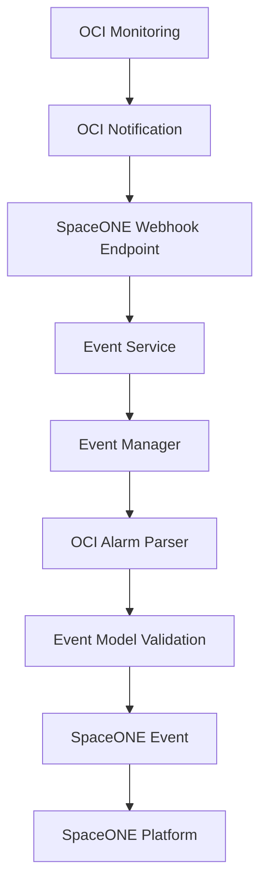

**Language**: [English](README.md) | [한국어](README_KR.md)

<h1 align="center">OCI Monitoring Webhook Plugin</h1>   

<br/>  
  
<br/>
<div>
    <p> 
        <br>  
        <a href="https://www.apache.org/licenses/LICENSE-2.0"  target="_blank"></a> 
    </p> 
</div>
<br/>

**Oracle Cloud Infrastructure용 SpaceONE 모니터링 웹훅 플러그인**

plugin-oci-monitoring-mon-webhook는 SpaceONE이 웹훅 엔드포인트를 통해 Oracle Cloud Infrastructure (OCI) Monitoring 서비스로부터 모니터링 알림을 수신하고 처리할 수 있도록 하며, OCI의 모니터링 및 알림 기능과의 원활한 통합을 제공합니다.

---

## 목차

- [개요](#개요)
- [기능](#기능)
- [웹훅 데이터 스키마](#웹훅-데이터-스키마)
- [이벤트 처리 로직](#이벤트-처리-로직)
- [사용 예제](#사용-예제)
- [테스트](#테스트)
- [플러그인 아키텍처](#플러그인-아키텍처)
- [개발](#개발)
- [오류 처리](#오류-처리)

---

## 개요

이 플러그인은 웹훅 엔드포인트를 통해 OCI 알람 알림을 SpaceONE 이벤트로 변환합니다. Compute, Database, Storage, Networking 등 다양한 OCI 서비스를 지원하여 Oracle Cloud Infrastructure 전반에 걸친 통합 모니터링을 제공합니다.

### 주요 이점
- **통합 모니터링**: SpaceONE 플랫폼 내에서 OCI 알림 중앙 집중화
- **실시간 처리**: OCI 웹훅으로부터 즉시 이벤트 처리
- **표준화된 형식**: OCI 특화 데이터를 SpaceONE 표준 이벤트로 변환
- **다중 서비스 지원**: 다양한 OCI 서비스의 알림 처리

---

## 기능

### 핵심 기능
- **OCI 웹훅 처리**: OCI Monitoring 웹훅 알림 수신 및 파싱
- **이벤트 변환**: OCI 알람 데이터를 SpaceONE 이벤트 형식으로 변환
- **다중 알람 지원**: 단일 웹훅 페이로드에서 여러 알람 처리
- **자동 중복 제거**: OCI dedupeKey를 사용한 이벤트 중복 제거
- **리소스 매핑**: OCI 알람 메타데이터에서 리소스 정보 추출
- **심각도 매핑**: OCI 심각도 수준을 SpaceONE 표준으로 매핑
- **상태 전환**: 알람 상태 변화 처리 (RECOVERY, ALERT)

### 지원되는 OCI 서비스
- **Compute**: 인스턴스, 커스텀 이미지, 자동 확장
- **Database**: Autonomous Database, MySQL, PostgreSQL, NoSQL
- **Storage**: 블록 볼륨, 오브젝트 스토리지, 파일 스토리지
- **Networking**: VCN, 로드 밸런서, FastConnect
- **Security**: 키 관리, WAF
- **Monitoring**: 알람, 메트릭
- **기타**: 모니터링 알람을 지원하는 모든 OCI 서비스

---

## 웹훅 데이터 스키마

### OCI 웹훅 페이로드 구조

플러그인은 다음 구조를 가진 OCI Monitoring 웹훅 알림을 예상합니다:

#### **필수 필드:**
- `dedupeKey`: 알람 중복 제거를 위한 고유 식별자
- `alarmMetaData`: 알람 세부 정보 및 메타데이터를 포함하는 배열

#### **선택적 필드:**
- `title`: 알람 제목/이름
- `body`: 알람 설명
- `type`: 알람 상태 전환 유형 (OK_TO_FIRING, FIRING_TO_OK 등)
- `severity`: 알람 심각도 수준 (CRITICAL, ERROR, WARNING, INFO)
- `timestamp`: 알람 발생 타임스탬프
- `timestampEpochMillis`: 밀리초 단위 에포크 타임스탬프

#### **샘플 웹훅 페이로드:**

```json
{
  "dedupeKey": "6b28ce05-7021-4407-b9c0-xxxxxxx",
  "title": "Database Availability Alert",
  "body": "Database availability outside threshold",
  "type": "OK_TO_FIRING",
  "severity": "CRITICAL",
  "timestampEpochMillis": 1761563100000,
  "timestamp": "2025-10-27T11:05:00Z",
  "alarmMetaData": [
    {
      "id": "ocid1.alarm.oc1.ap-seoul-1.aaaaaaaazxxxxxx",
      "status": "FIRING",
      "severity": "CRITICAL",
      "namespace": "oci_autonomous_database",
      "query": "DatabaseAvailability[5m]{deploymentType = \"Shared\"}.rate() not in (1, 10)",
      "dimensions": [
        {
          "resourceId": "OCID1.AUTONOMOUSDATABASE.OC1.AP-SEOUL-1.ANUWGLJRExxxxxx",
          "resourceName": "ARAMCODEVAUTONOMOUS",
          "region": "ap-seoul-1"
        }
      ],
      "alarmUrl": "https://cloud.oracle.com/monitoring/alarms/ocid1.alarm.oc1.ap-seoul-1.aaaaaaaazxxxxxx?region=ap-seoul-1",
      "alarmSummary": "Database availability monitoring alarm"
    }
  ]
}
```

---

## 이벤트 처리 로직

### 이벤트 키 생성
중복 제거를 위한 고유 이벤트 식별자로 `raw_data.dedupeKey`를 사용합니다.

### 이벤트 유형 매핑
| OCI 유형 | SpaceONE 이벤트 유형 |
|----------|-------------------|
| OK_TO_FIRING, REPEAT | ALERT |
| FIRING_TO_OK, RESET | RECOVERY |

### 심각도 매핑
| OCI 심각도 | SpaceONE 심각도 |
|-------------|------------------|
| CRITICAL | CRITICAL |
| ERROR | ERROR |
| WARNING | WARNING |
| INFO | INFO |

### 리소스 정보 추출
알람 차원에서 리소스 세부 정보를 추출합니다:
- `resource_id`: OCI 리소스 OCID
- `name`: 리소스 표시 이름
- `resource_type`: "inventory.CloudService"로 설정

### 추가 정보
보조 알람 데이터를 포함합니다:
- `alarm_url`: OCI 알람으로의 직접 링크
- `namespace`: OCI 서비스 네임스페이스
- `status`: 현재 알람 상태
- `region`: OCI 리전

---

## 사용 예제

### SpaceONE 이벤트 출력

OCI 알람이 처리되면 플러그인은 SpaceONE 이벤트를 생성합니다:

```json
{
  "event_key": "6b28ce05-7021-4407-b9c0-xxxxxxx",
  "event_type": "ALERT",
  "title": "Database Availability Alert (CRITICAL)",
  "description": "Database availability outside threshold",
  "severity": "CRITICAL",
  "resource": {
    "resource_id": "OCID1.AUTONOMOUSDATABASE.OC1.AP-SEOUL-1.ANUWGLJRExxxxxx",
    "name": "ARAMCODEVAUTONOMOUS",
    "resource_type": "inventory.CloudService"
  },
  "rule": "DatabaseAvailability[5m]{deploymentType = \"Shared\"}.rate() not in (1, 10)",
  "occurred_at": "2025-10-27T11:05:00Z",
  "additional_info": {
    "alarm_url": "https://cloud.oracle.com/monitoring/alarms/ocid1.alarm.oc1.ap-seoul-1.aaaaaaaazxxxxxx?region=ap-seoul-1",
    "namespace": "oci_autonomous_database",
    "status": "FIRING",
    "region": "ap-seoul-1"
  }
}
```

---

## 테스트

### cURL을 사용한 수동 테스트

샘플 OCI 알림으로 웹훅 엔드포인트를 테스트합니다:

```bash
curl -X POST https://your-spaceone-webhook-url/monitoring/v1/webhook/{webhook_id}/{access_key}/events \
  -H "Content-Type: application/json" \
  -d '{
    "dedupeKey": "test-dedupe-key-123",
    "title": "Test Database Alert",
    "body": "Test notification from OCI Monitoring",
    "type": "OK_TO_FIRING",
    "severity": "WARNING",
    "timestamp": "2025-11-23T10:00:00Z",
    "alarmMetaData": [
      {
        "id": "ocid1.alarm.oc1.test.example",
        "status": "FIRING",
        "severity": "WARNING",
        "namespace": "oci_compute",
        "query": "CPUUtilization[1m].mean() > 80",
        "dimensions": [
          {
            "resourceId": "ocid1.instance.oc1.test.example",
            "resourceName": "test-instance",
            "region": "us-ashburn-1"
          }
        ],
        "alarmUrl": "https://cloud.oracle.com/monitoring/alarms/test",
        "alarmSummary": "CPU utilization test alarm"
      }
    ]
  }'
```

### 통합 테스트

#### **OCI Console에서 테스트:**

1. **테스트 알람 생성**: OCI Console에서 테스트 알람 생성
2. **알림 구성**: SpaceONE 웹훅으로 알림 구성
3. **알람 트리거**: 임계값 초과로 알람 트리거
4. **이벤트 확인**: SpaceONE에서 이벤트 확인

#### **테스트 시나리오:**

| 시나리오 | OCI 유형 | 예상 SpaceONE 이벤트 |
|----------|----------|------------------------|
| 새 알림 | OK_TO_FIRING | event_type: ALERT |
| 알림 복구 | FIRING_TO_OK | event_type: RECOVERY |
| 알림 반복 | REPEAT | event_type: ALERT |
| 알림 재설정 | RESET | event_type: RECOVERY |

---

## 플러그인 아키텍처

### Service-Manager-Model 패턴

플러그인은 SpaceONE 표준 아키텍처를 따릅니다:

```
Service Layer
├── WebhookService - 플러그인 초기화 및 검증
└── EventService - 웹훅 데이터 파싱 및 이벤트 생성

Manager Layer
├── EventManager - OCI 웹훅 데이터의 메인 처리 로직
└── OCIAlarm - OCI 알람 데이터 변환을 위한 전용 클래스

Model Layer
└── EventModel - 데이터 검증 및 구조 정의
```

### 데이터 플로우



### 주요 구성 요소

#### **EventService**
- 웹훅 요청의 메인 진입점
- OCI 확인 URL 처리
- EventManager로 처리 위임

#### **EventManager**
- OCI 알람 데이터 형식 감지
- RULE_CHANGE 알림 필터링
- 처리된 이벤트 검증

#### **OCIAlarm**
- OCI 알람 데이터를 SpaceONE 형식으로 변환
- 리소스 정보 추출 처리
- 심각도 및 이벤트 유형 매핑

#### **EventModel**
- 이벤트 데이터 구조 검증
- SpaceONE 표준 준수 보장
- 타입 안전성 제공

---

## 개발

### 사전 요구사항

```bash
# 의존성 설치
pip install -r pkg/pip_requirements.txt

# 개발 의존성 설치
pip install pytest pytest-cov mock
```

### 프로젝트 구조

```
plugin-oci-monitoring-mon-webhook/
├── README.md                    # 프로젝트 문서
├── Dockerfile                   # 컨테이너 빌드 설정
├── pkg/pip_requirements.txt     # Python 의존성
├── src/spaceone/monitoring/     # 플러그인 소스 코드
│   ├── service/                 # 서비스 계층
│   │   ├── webhook_service.py   # 웹훅 서비스 구현
│   │   └── event_service.py     # 이벤트 처리 서비스
│   ├── manager/                 # 매니저 계층
│   │   ├── event_manager.py     # 이벤트 처리 로직
│   │   └── oci_alarm.py         # OCI 알람 변환
│   ├── model/                   # 데이터 모델
│   │   └── event_response_model.py # 이벤트 구조 정의
│   ├── interface/grpc/          # gRPC 인터페이스
│   │   ├── webhook.py           # 웹훅 gRPC 서비스
│   │   └── event.py             # 이벤트 gRPC 서비스
│   └── conf/                    # 설정
│       └── global_conf.py       # 글로벌 설정
└── test/                        # 테스트 코드
    └── api/                     # API 테스트
```

### 테스트 실행

```bash
# 모든 테스트 실행
python -m pytest test/

# 특정 테스트 실행
python -m pytest test/api/test_oci_event.py

# 커버리지와 함께 실행
python -m pytest --cov=src test/
```

### Docker 이미지 빌드

```bash
# 이미지 빌드
docker build -t spaceone/plugin-oci-monitoring-webhook .

# 컨테이너 실행
docker run -p 50051:50051 spaceone/plugin-oci-monitoring-webhook
```

---

## 오류 처리

### 일반적인 오류 시나리오

| 오류 유형 | 원인 | 해결방법 |
|------------|-------|----------|
| `ERROR_UNSUPPORTED_DATA_FORMAT` | 잘못된 웹훅 페이로드 | OCI 알림 형식 확인 |
| `ERROR_CHECK_VALIDITY` | 이벤트 검증 실패 | 필수 필드 존재 여부 확인 |
| `RULE_CHANGE notifications` | OCI 규칙 변경 이벤트 | 자동으로 무시됨 (예상 동작) |
| `Missing dedupeKey` | 불완전한 OCI 페이로드 | OCI 알람 구성 확인 |
| `Missing alarmMetaData` | 잘못된 알람 구조 | OCI 알람 설정 확인 |

### 오류 응답 형식

```json
{
  "error": {
    "code": "ERROR_UNSUPPORTED_DATA_FORMAT",
    "message": "지원되지 않는 웹훅 데이터 형식",
    "details": {
      "required_fields": ["dedupeKey", "alarmMetaData"],
      "received_fields": ["title", "body"]
    }
  }
}
```

### 디버깅 팁

1. **웹훅 로그 확인**: 처리 오류에 대한 SpaceONE 웹훅 로그 모니터링
2. **페이로드 검증**: OCI 웹훅이 필수 필드를 전송하는지 확인
3. **연결 테스트**: OCI가 SpaceONE 웹훅 엔드포인트에 도달할 수 있는지 확인
4. **구성 검토**: OCI 알림 토픽 및 구독 설정 확인

---

## 라이선스

Apache License 2.0
