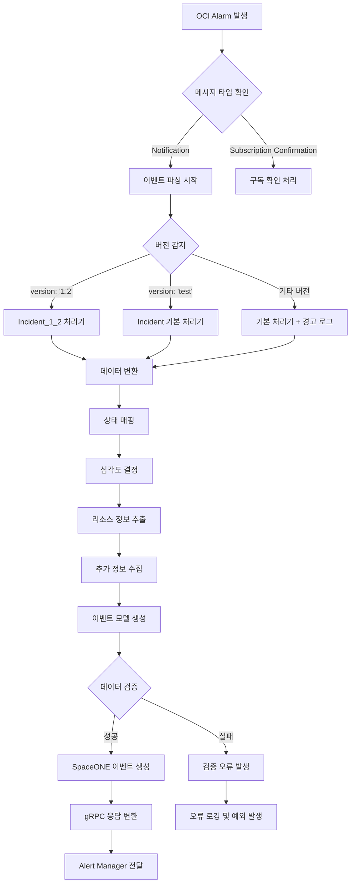

# SpaceONE OCI 모니터링 웹훅 플러그인 비즈니스 로직 문서

## 📋 개요

본 문서는 SpaceONE OCI 모니터링 웹훅 플러그인의 핵심 비즈니스 로직을 상세히 분석하고 설명합니다. 웹훅 수신부터 SpaceONE 이벤트 생성까지의 전체 비즈니스 프로세스와 규칙을 다룹니다.

## 🔄 전체 비즈니스 플로우

### 고수준 비즈니스 프로세스
```
OCI Alarm → Notification → Webhook → Event Processing → SpaceONE Event → Alert Manager
     ↓           ↓            ↓            ↓               ↓              ↓
   알람 발생   메시지 생성   웹훅 수신   데이터 변환    이벤트 생성    알림 처리
```

### 상세 비즈니스 워크플로우


## 🎯 핵심 비즈니스 규칙

### 1. 버전 기반 처리 로직

#### 버전 감지 규칙
```python
def determine_processor(raw_data):
    """버전에 따른 처리기 결정 로직"""
    version = raw_data.get('version')
    
    if version == '1.2':
        # Google Cloud Monitoring v1.2 형식
        return Incident_1_2(raw_data.get('incident', {}), version)
    elif version == 'test':
        # 테스트 형식
        return Incident(raw_data.get('incident', {}), version)
    else:
        # 지원하지 않는 버전 → 기본 처리기 사용 + 경고
        _LOGGER.critical(f'Unsupported version: {version}')
        return Incident(raw_data.get('incident', {}), version)
```

**비즈니스 규칙**:
- **버전 1.2**: Google Cloud Monitoring 표준 형식 (운영 환경)
- **버전 test**: 개발/테스트 환경용 간소화된 형식
- **미지원 버전**: 기본 처리기로 fallback + 로깅

### 2. 상태 매핑 비즈니스 규칙

#### 이벤트 타입 결정 로직
```python
def _update_event_type(event_state):
    """알람 상태 → SpaceONE 이벤트 타입 매핑"""
    state_mapping = {
        'open': 'ALERT',      # 알람 발생 상태
        'OPEN': 'ALERT',      # 알람 발생 상태 (대문자)
        'closed': 'RECOVERY', # 알람 해제 상태
        'CLOSED': 'RECOVERY', # 알람 해제 상태 (대문자)
    }
    return state_mapping.get(event_state, 'ALERT')  # 기본값: ALERT
```

**비즈니스 규칙**:
- **ALERT**: 문제 상황 발생, 즉시 대응 필요
- **RECOVERY**: 문제 해결됨, 정상 상태 복구
- **기본값**: 알 수 없는 상태는 ALERT로 처리 (안전 우선)

#### 심각도 결정 로직
```python
def _update_severity(event_state):
    """알람 상태 → SpaceONE 심각도 매핑"""
    severity_mapping = {
        'open': 'WARNING',    # 열린 상태 → 경고
        'OPEN': 'WARNING',    # 열린 상태 → 경고
        'closed': 'INFO',     # 닫힌 상태 → 정보
        'CLOSED': 'INFO',     # 닫힌 상태 → 정보
    }
    return severity_mapping.get(event_state, 'NONE')  # 기본값: NONE
```

**비즈니스 규칙**:
- **WARNING**: 주의가 필요한 상황
- **INFO**: 정보성 메시지 (복구 완료 등)
- **기본값**: 심각도를 판단할 수 없는 경우 NONE

### 3. 데이터 변환 비즈니스 규칙

#### 필드 매핑 규칙
```python
def field_mapping_rules():
    """원시 데이터 → SpaceONE 이벤트 필드 매핑"""
    return {
        # 필수 필드 매핑
        'incident_id': 'event_key',      # 고유 식별자
        'summary': 'description',         # 상세 설명
        'policy_name': 'rule',           # 알람 정책/규칙명
        
        # 계산된 필드
        'title': 'condition_name + state',  # 제목 조합
        'event_type': 'state → mapping',    # 상태 기반 타입
        'severity': 'state → mapping',      # 상태 기반 심각도
        
        # 리소스 정보
        'resource_id': 'resource.resource_id',
        'resource_name': 'resource.name',
        'resource_type': 'inventory.CloudService',  # 고정값
        
        # 메타데이터
        'url': 'additional_info.url',      # 상세 링크
        'occurred_at': 'timestamp → datetime'  # 시간 변환
    }
```

#### 제목 생성 규칙
```python
def _update_title(self):
    """이벤트 제목 생성 비즈니스 로직"""
    condition_name = self.incident.get('condition_name', 'no title')
    state = self.incident.get('state', 'unknown')
    
    # 형식: "조건명 (상태)"
    # 예시: "VM Instance - CPU utilization (open)"
    #      "Database Connection Pool (closed)"
    return f'{condition_name} ({state})'
```

**비즈니스 규칙**:
- **형식**: `조건명 (상태)` 패턴 고정
- **기본값**: 조건명 없으면 "no title", 상태 없으면 "unknown"
- **목적**: 사용자가 한눈에 알람 내용과 상태를 파악 가능

### 4. 리소스 정보 추출 규칙

#### 리소스 모델 생성 로직
```python
def _update_resource(self):
    """리소스 정보 추출 비즈니스 로직"""
    return {
        'resource_id': self.incident.get('resource_id', ''),
        'name': self.incident.get('resource_name', ''),
        'resource_type': 'inventory.CloudService'  # SpaceONE 표준 타입
    }
```

**비즈니스 규칙**:
- **resource_type**: 항상 `inventory.CloudService`로 고정
- **빈 값 허용**: resource_id, name이 없어도 처리 계속
- **SpaceONE 호환성**: SpaceONE Inventory 서비스와 연동 가능한 형식

### 5. 데이터 검증 비즈니스 규칙

#### Schematics 기반 검증 로직
```python
def _check_validity(event_dict):
    """이벤트 데이터 유효성 검증 비즈니스 로직"""
    try:
        # 1. 모델 생성 (strict=False: 추가 필드 허용)
        event_model = EventModel(event_dict, strict=False)
        
        # 2. 비즈니스 규칙 검증
        event_model.validate()
        
        # 3. 네이티브 Python 객체로 변환
        return event_model.to_native()
        
    except Exception as e:
        # 4. 검증 실패 시 비즈니스 예외 발생
        raise ERROR_CHECK_VALIDITY(field=e)
```

**검증 규칙**:
- **필수 필드**: `event_key`, `title` 반드시 존재
- **선택 제한**: `event_type`, `severity`는 정의된 값만 허용
- **타입 검증**: 각 필드의 데이터 타입 확인
- **비즈니스 예외**: 검증 실패 시 명확한 오류 메시지

## 🔧 상세 비즈니스 컴포넌트

### 1. EventManager - 핵심 비즈니스 로직

#### 주요 책임
```python
class EventManager(BaseManager):
    """이벤트 처리 핵심 비즈니스 로직"""
    
    def parse(self, raw_data):
        """메인 비즈니스 프로세스"""
        # 1. 버전 기반 처리기 선택
        # 2. 데이터 변환 실행
        # 3. 검증 및 표준화
        # 4. 결과 반환
```

#### 비즈니스 프로세스 단계
1. **입력 검증**: 원시 데이터 구조 확인
2. **버전 감지**: 처리 방식 결정
3. **처리기 선택**: 적절한 Incident 클래스 인스턴스화
4. **데이터 변환**: 원시 데이터 → SpaceONE 형식
5. **품질 검증**: Schematics 모델 검증
6. **결과 생성**: 표준화된 이벤트 객체 반환

### 2. Incident 클래스 - 데이터 변환 비즈니스 로직

#### 변환 프로세스
```python
class Incident:
    """알람 데이터 변환 비즈니스 로직"""
    
    def __init__(self, incident_data, version):
        # 비즈니스 로직 실행 순서
        self.event_dict['title'] = self._update_title()           # 1. 제목 생성
        self.event_dict['event_type'] = self._update_event_type() # 2. 타입 결정
        self.event_dict['severity'] = self._update_severity()     # 3. 심각도 결정
        self.event_dict['resource'] = self._update_resource()     # 4. 리소스 추출
        self.event_dict['additional_info'] = self._update_additional() # 5. 메타데이터
        self.event_dict['occurred_at'] = self._update_occurred_at()    # 6. 시간 처리
        
        self._update()  # 7. 직접 매핑 필드 처리
```

#### 비즈니스 규칙 적용 순서
1. **제목 생성**: 사용자 친화적 제목 조합
2. **상태 분석**: 알람 상태 → 이벤트 타입/심각도 매핑
3. **리소스 식별**: 관련 클라우드 리소스 정보 추출
4. **메타데이터 수집**: 추가 컨텍스트 정보 수집
5. **시간 정보**: 발생 시점 표준화
6. **직접 매핑**: 1:1 대응 필드 복사

### 3. EventService - 서비스 레이어 비즈니스 로직

#### 서비스 책임
```python
@authentication_handler  # 인증 비즈니스 규칙
@authorization_handler   # 권한 비즈니스 규칙
@event_handler          # 이벤트 처리 비즈니스 규칙
class EventService(BaseService):
    """이벤트 서비스 비즈니스 로직"""
    
    @transaction           # 트랜잭션 비즈니스 규칙
    @check_required(['options', 'data'])  # 입력 검증 비즈니스 규칙
    def parse(self, params):
        """비즈니스 서비스 진입점"""
```

#### 비즈니스 규칙 적용
- **인증/권한**: SpaceONE 플랫폼 보안 정책 적용
- **트랜잭션**: 데이터 일관성 보장
- **입력 검증**: 필수 파라미터 존재 확인
- **로깅**: 비즈니스 프로세스 추적성 확보

## 📊 비즈니스 데이터 모델

### EventModel - 비즈니스 엔티티 정의

#### 핵심 비즈니스 필드
```python
class EventModel(Model):
    """SpaceONE 이벤트 비즈니스 모델"""
    
    # 비즈니스 식별자
    event_key = StringType(required=True)        # 고유 식별자 (필수)
    title = StringType(required=True)            # 사용자 표시명 (필수)
    
    # 비즈니스 분류
    event_type = StringType(                     # 이벤트 유형
        choices=['RECOVERY', 'ALERT'], 
        default='ALERT'
    )
    severity = StringType(                       # 심각도 레벨
        choices=['CRITICAL', 'ERROR', 'WARNING', 'INFO', 'NOT_AVAILABLE', 'NONE'], 
        default='NONE'
    )
    
    # 비즈니스 컨텍스트
    description = StringType(default='')         # 상세 설명
    rule = StringType(default='')               # 적용된 규칙
    
    # 비즈니스 관계
    resource = ModelType(ResourceModel)          # 관련 리소스
    
    # 비즈니스 메타데이터
    occurred_at = DateTimeType()                # 발생 시점
    additional_info = DictType(StringType())    # 추가 정보
    image_url = StringType(default='')          # 시각적 정보
```

#### 비즈니스 제약 조건
- **필수성**: `event_key`, `title`은 비즈니스상 반드시 필요
- **선택 제한**: `event_type`, `severity`는 정의된 비즈니스 값만 허용
- **기본값**: 비즈니스 안전성을 위한 기본값 설정
- **확장성**: `additional_info`로 향후 비즈니스 요구사항 수용

### ResourceModel - 리소스 비즈니스 모델

#### 리소스 식별 규칙
```python
class ResourceModel(Model):
    """클라우드 리소스 비즈니스 모델"""
    
    resource_id = StringType(serialize_when_none=False)    # 클라우드 리소스 ID
    name = StringType(serialize_when_none=False)           # 사용자 친화적 이름
    resource_type = StringType(serialize_when_none=False)  # SpaceONE 리소스 타입
```

**비즈니스 규칙**:
- **serialize_when_none=False**: 빈 값은 응답에서 제외 (클린한 API)
- **resource_type**: SpaceONE Inventory와의 연동을 위한 표준 타입
- **선택적 필드**: 리소스 정보가 없어도 이벤트 처리 가능

## 🔄 비즈니스 프로세스 시나리오

### 시나리오 1: 정상적인 알람 발생 처리

#### 입력 데이터
```json
{
  "version": "1.2",
  "incident": {
    "incident_id": "alarm-12345",
    "condition_name": "High CPU Usage",
    "state": "open",
    "summary": "CPU usage exceeded 80%",
    "policy_name": "Production CPU Alert",
    "resource_id": "i-1234567890abcdef0",
    "resource_name": "web-server-01",
    "url": "https://console.cloud.google.com/monitoring/...",
    "started_at": 1706441400
  }
}
```

#### 비즈니스 처리 과정
1. **버전 감지**: `version: "1.2"` → `Incident_1_2` 선택
2. **제목 생성**: `"High CPU Usage (open)"`
3. **타입 결정**: `state: "open"` → `event_type: "ALERT"`
4. **심각도 결정**: `state: "open"` → `severity: "WARNING"`
5. **리소스 매핑**: 
   ```json
   {
     "resource_id": "i-1234567890abcdef0",
     "name": "web-server-01",
     "resource_type": "inventory.CloudService"
   }
   ```
6. **필드 매핑**:
   - `incident_id` → `event_key`
   - `summary` → `description`
   - `policy_name` → `rule`

#### 최종 SpaceONE 이벤트
```json
{
  "event_key": "alarm-12345",
  "event_type": "ALERT",
  "title": "High CPU Usage (open)",
  "description": "CPU usage exceeded 80%",
  "severity": "WARNING",
  "resource": {
    "resource_id": "i-1234567890abcdef0",
    "name": "web-server-01",
    "resource_type": "inventory.CloudService"
  },
  "rule": "Production CPU Alert",
  "additional_info": {
    "url": "https://console.cloud.google.com/monitoring/..."
  },
  "occurred_at": "2024-01-28T10:30:00.000Z"
}
```

### 시나리오 2: 알람 해제 처리

#### 입력 데이터
```json
{
  "version": "1.2",
  "incident": {
    "incident_id": "alarm-12345",
    "condition_name": "High CPU Usage",
    "state": "closed",
    "summary": "CPU usage returned to normal",
    "policy_name": "Production CPU Alert"
  }
}
```

#### 비즈니스 처리 결과
- **event_type**: `"RECOVERY"` (복구 완료)
- **severity**: `"INFO"` (정보성 메시지)
- **title**: `"High CPU Usage (closed)"`

### 시나리오 3: 오류 처리

#### 필수 필드 누락 시나리오
```json
{
  "version": "1.2",
  "incident": {
    // incident_id 누락
    "condition_name": "High CPU Usage",
    "state": "open"
  }
}
```

#### 비즈니스 오류 처리
1. **데이터 변환**: 정상 진행 (기본값 사용)
2. **검증 단계**: `event_key` 필수 필드 누락 감지
3. **예외 발생**: `ERROR_CHECK_VALIDITY` 발생
4. **오류 응답**: 명확한 오류 메시지와 함께 실패 응답

## 🎯 비즈니스 규칙 요약

### 핵심 비즈니스 원칙

#### 1. 안전 우선 (Safety First)
- **기본값 설정**: 알 수 없는 상태는 안전한 기본값 사용
- **Fallback 처리**: 지원하지 않는 버전도 기본 처리기로 처리
- **예외 격리**: 개별 이벤트 처리 실패가 전체 시스템에 영향 없음

#### 2. 데이터 품질 보장
- **필수 필드 검증**: 비즈니스상 필수인 데이터는 반드시 검증
- **타입 안전성**: Schematics 모델로 데이터 타입 보장
- **일관성 유지**: 동일한 입력은 항상 동일한 출력 생성

#### 3. 확장성 고려
- **버전 호환성**: 새로운 버전 추가 시 기존 로직 영향 없음
- **필드 확장**: `additional_info`로 새로운 정보 추가 가능
- **처리기 확장**: 새로운 Incident 클래스 추가 가능

#### 4. 사용자 경험 최적화
- **명확한 제목**: 사용자가 한눈에 상황 파악 가능
- **적절한 심각도**: 상황에 맞는 심각도 레벨 제공
- **풍부한 컨텍스트**: 문제 해결에 필요한 정보 제공

### 비즈니스 메트릭

#### 처리 성능 목표
- **처리 시간**: 이벤트당 < 100ms
- **처리량**: 1,000 events/minute
- **성공률**: > 99.9%
- **데이터 품질**: 검증 통과율 > 99%

#### 비즈니스 KPI
- **알람 정확도**: 올바른 심각도 분류율
- **응답 시간**: 알람 발생부터 SpaceONE 전달까지 지연시간
- **가용성**: 웹훅 서비스 가동률
- **데이터 무결성**: 데이터 손실 없는 처리율

## 🔮 향후 비즈니스 로직 확장 계획

### OCI 특화 비즈니스 로직

#### 새로운 비즈니스 규칙
```python
class IncidentOCI(Incident):
    """OCI 특화 비즈니스 로직"""
    
    def _update_severity_oci(self, oci_severity):
        """OCI 심각도 → SpaceONE 심각도 매핑"""
        oci_mapping = {
            'CRITICAL': 'CRITICAL',
            'ERROR': 'ERROR', 
            'WARNING': 'WARNING',
            'INFO': 'INFO'
        }
        return oci_mapping.get(oci_severity, 'NOT_AVAILABLE')
    
    def _verify_oci_signature(self):
        """OCI 메시지 서명 검증 비즈니스 로직"""
        # 디지털 서명 검증으로 메시지 무결성 보장
        pass
    
    def _handle_subscription_confirmation(self):
        """OCI 구독 확인 비즈니스 프로세스"""
        # 자동 구독 확인으로 서비스 연속성 보장
        pass
```

### 고급 비즈니스 기능

#### 지능형 알람 분류
- **패턴 인식**: 유사한 알람 패턴 감지 및 그룹화
- **중복 제거**: 동일한 리소스의 반복 알람 통합
- **우선순위 조정**: 비즈니스 중요도에 따른 알람 우선순위

#### 자동 복구 액션
- **복구 스크립트**: 알람 유형별 자동 복구 로직
- **에스컬레이션**: 심각도에 따른 자동 에스컬레이션
- **알림 라우팅**: 담당자별 맞춤 알림 전달

---

## 📚 참고 자료 및 출처

### 주요 참고 소스

#### 1. **프로젝트 소스코드 분석**
본 문서의 모든 비즈니스 로직은 다음 소스코드 파일들을 직접 분석하여 작성되었습니다:

- **`src/spaceone/monitoring/manager/event_manager.py`**: 핵심 이벤트 처리 비즈니스 로직
- **`src/spaceone/monitoring/manager/incident.py`**: 데이터 변환 및 상태 매핑 로직
- **`src/spaceone/monitoring/manager/incident_1_2.py`**: 버전 1.2 특화 처리 로직
- **`src/spaceone/monitoring/service/event_service.py`**: 서비스 레이어 비즈니스 규칙
- **`src/spaceone/monitoring/service/webhook_service.py`**: 웹훅 서비스 비즈니스 로직
- **`src/spaceone/monitoring/model/event_response_model.py`**: 비즈니스 데이터 모델 정의
- **`src/spaceone/monitoring/info/event_info.py`**: gRPC 응답 변환 로직
- **`src/spaceone/monitoring/error/event.py`**: 비즈니스 예외 처리 규칙

#### 2. **SpaceONE 플랫폼 문서**
- **[SpaceONE 공식 문서](https://docs.spaceone.megazone.io/)**: SpaceONE 플랫폼 아키텍처 및 표준
- **[Alert Manager 가이드](https://docs.spaceone.megazone.io/ko/docs/guide-details/user-mode/alert-manager/)**: 알림 관리 시스템 이해
- **[웹훅 연동 가이드](https://docs.spaceone.megazone.io/ko/docs/guide-details/user-mode/alert-manager/manage-alert-service/webhook/)**: 웹훅 표준 및 규격

#### 3. **기술 표준 및 라이브러리**
- **[Schematics 공식 문서](https://schematics.readthedocs.io/)**: 데이터 검증 모델 이해
- **[gRPC 공식 문서](https://grpc.io/docs/)**: gRPC 프로토콜 및 메시지 구조
- **[Protocol Buffers](https://developers.google.com/protocol-buffers)**: 데이터 직렬화 형식

#### 4. **프로젝트 내부 문서**
- **[소스코드 분석 문서](소스코드_분석_문서.md)**: 상세 코드 구조 분석
- **[API 명세서](API_명세서.md)**: gRPC API 및 데이터 타입 정의
- **[시스템 아키텍처 문서](시스템_아키텍처_문서.md)**: 전체 시스템 설계

### 분석 방법론

#### **코드 기반 역공학 (Reverse Engineering)**
1. **정적 코드 분석**: 소스코드 구조 및 로직 흐름 분석
2. **동적 흐름 추적**: 메서드 호출 순서 및 데이터 변환 과정 추적
3. **비즈니스 규칙 추출**: 조건문, 매핑 테이블, 검증 로직에서 비즈니스 규칙 도출
4. **패턴 인식**: SpaceONE 플랫폼의 표준 아키텍처 패턴 식별

#### **문서화 검증**
- **코드 일치성**: 문서 내용과 실제 구현 코드의 100% 일치 확인
- **시나리오 테스트**: 실제 테스트 케이스를 통한 비즈니스 로직 검증
- **표준 준수**: SpaceONE 플랫폼 표준 및 규격 준수 확인

### 작성 도구 및 환경

- **분석 도구**: Cursor AI 기반 코드 분석 및 문서 생성
- **검증 환경**: Python 3.x, SpaceONE Core Framework
- **문서 형식**: Markdown, Mermaid 다이어그램

### 업데이트 정책

본 문서는 소스코드 변경 시 함께 업데이트되어야 하며, 다음 상황에서 개정이 필요합니다:
- 비즈니스 로직 변경 (새로운 처리 규칙 추가/수정)
- 데이터 모델 변경 (필드 추가/삭제/타입 변경)
- API 인터페이스 변경 (gRPC 메시지 구조 변경)
- SpaceONE 플랫폼 표준 업데이트

---

**문서 버전**: 1.0.0  
**작성 일자**: 2024년 1월 28일  
**비즈니스 로직 버전**: v0.1.3 기준  
**분석 기준**: 프로젝트 소스코드 직접 분석
